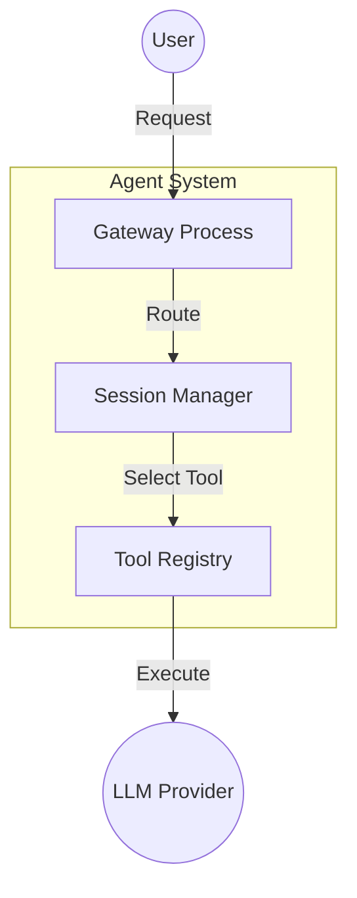

# Mermaid Diagrams

Generate professional, consistently-styled Mermaid diagrams for technical content with automatic template selection, content generation, and quality validation.

## Quick Start

**Subagent Pattern (Recommended):**

When user requests diagram generation, spawn a subagent:

```
Generate 3 Mermaid diagrams for /path/to/chapter-01.md and save to diagrams/chapter-01/
```

The subagent will:
1. Read chapter content
2. Select appropriate templates
3. Generate placeholder content
4. Create content.json
5. Run generation script
6. Validate output

**Manual Pattern:**

```bash
# 1. Create content.json (see assets/example-content.json)
# 2. Render diagrams
node scripts/generate.mjs --content content.json --out diagrams/chapter-01

# 3. Validate
node scripts/validate.mjs --dir diagrams/chapter-01
```

## Prerequisites

### Automated Installation (Recommended)

Run the installation script to automatically install and verify mermaid-cli:

```bash
cd $SKILL_DIR  # Path to skill-mermaid-diagrams directory
./scripts/install-deps.sh
```

The script will:
- Check Node.js version (>= 18.0.0 required)
- Install or upgrade mermaid-cli to latest version
- Verify installation and version compatibility
- Provide troubleshooting guidance if needed

### Manual Installation

Alternatively, install Mermaid CLI globally:

```bash
npm install -g @mermaid-js/mermaid-cli
```

Verify installation:

```bash
mmdc --version  # Should be >= 11.0.0
```

## Usage Patterns

### Subagent Workflow (Primary Pattern)

When a user requests diagram generation, spawn a subagent to handle the complete workflow:

```
Task: Generate 3 Mermaid diagrams for chapter 5

Steps:
1. Read $CONTENT_DIR/chapters/chapter-05.md
2. Analyze content and select 3 appropriate diagram templates from: architecture, flowchart, sequence, concept-map, timeline, comparison
3. For each selected template:
   - Read template from $SKILL_DIR/assets/
   - Extract placeholders ({{PLACEHOLDER_NAME}} format)
   - Generate concise labels (max 8 words each) based on chapter content
4. Create content.json with structure:
   {
     "chapter": "chapter-05.md",
     "diagrams": [
       {
         "template": "architecture",
         "placeholders": { "SYSTEM_NAME": "...", ... }
       },
       ...
     ]
   }
5. Save to $CONTENT_DIR/diagrams/chapter-05/content.json
6. Run: node $SKILL_DIR/scripts/generate.mjs --content content.json --out $CONTENT_DIR/diagrams/chapter-05
7. Validate: node $SKILL_DIR/scripts/validate.mjs --dir $CONTENT_DIR/diagrams/chapter-05
8. Report success with file count

Note: Replace $SKILL_DIR and $CONTENT_DIR with actual paths:
- SKILL_DIR: Path to skill-mermaid-diagrams directory
- CONTENT_DIR: Path to your content/project directory
```

### Manual Content Generation

If generating content.json manually:

```bash
# 1. Create content.json (see assets/example-content.json)
# 2. Render
cd $SKILL_DIR  # Path to skill-mermaid-diagrams directory
node scripts/generate.mjs \
  --content /path/to/content.json \
  --out /path/to/output

# 3. Validate
node scripts/validate.mjs --dir /path/to/output
```

**Parameters:**
- `--content` / `-c`: Content JSON file (required)
- `--out` / `-o`: Output directory (default: `./diagrams`)

### Validate All Generated Diagrams

```bash
for dir in diagrams/chapter-*/; do
  node scripts/validate.mjs --dir "$dir"
done
```

## Available Templates

The skill includes 12 professionally-themed templates with consistent color schemes:

1. **architecture.mmd** - System architecture, component diagrams, tool integration
   - Use for: System components, tool pipelines, agent interactions
   - **Fixed node IDs** (space-safe): Uses C1, C2, C3 internally, only labels are customizable
   
2. **flowchart.mmd** - Decision flows, processes, workflows, debugging steps
   - Use for: Decision trees, process flows, validation workflows
   
3. **sequence.mmd** - Actor interactions, message passing, session patterns
   - Use for: API call sequences, actor communication, message flows
   
4. **concept-map.mmd** - Key concepts, mental models, paradigms, relationships
   - Use for: Hierarchical concepts, mental models, knowledge graphs
   - **Improved version** (graph-based, not mindmap): Full color control, readable text
   
5. **radial-concept.mmd** - Layered concepts radiating from center   - Use for: Progressive summarization, abstraction layers, hierarchical models
   - 4 color-coded levels: green → orange → blue → purple
   
6. **timeline.mmd** - Temporal progression, optimization stages, evolution
   - Use for: Project phases, evolution timelines, staged processes
   
7. **comparison.mmd** - Trade-offs, quadrant analysis (2D plotting)
   - Use for: Cost vs performance, effort vs impact (X/Y coordinate plotting)
   - **Requires X/Y coordinates** for items
   
8. **comparison-table.mmd** - Side-by-side feature comparison
   - Use for: AI vs Script decisions, option comparisons, feature matrices
   - **Alternative to quadrant** when you need simple side-by-side, not 2D plotting

9. **gantt.mmd** - Project timelines, task scheduling   - Use for: Project planning, milestone tracking, task dependencies
   - Supports: Multiple sections, task status (done/active/crit), date ranges

10. **mindmap.mmd** - Organic radial mind maps    - Use for: Brainstorming, organic thought structures, free-form concept mapping
    - **Limitation:** Auto-assigns colors/text (limited theme control)
    - **Alternative:** Use radial-concept.mmd for better color control

11. **class-diagram.mmd** - UML class diagrams
    - Use for: Object models, database schemas, system architecture (OOP)
    - Supports: Attributes, methods, relationships (inheritance, composition, association)

12. **state-diagram.mmd** - State machines, lifecycle diagrams
    - Use for: Process states, object lifecycles, workflow stages
    - Supports: Transitions with labels, notes on states, start/end markers

### Template Placeholder Reference

Each template requires specific placeholders. **All placeholders must be provided** to avoid rendering errors.

| Template | Placeholders | Complexity | Required Fields |
|----------|--------------|------------|-----------------|
| architecture | 10 | Medium | SYSTEM_NAME, COMPONENT_1-3_LABEL, EXTERNAL_1-2_LABEL, FLOW_1-4 |
| flowchart | 11 | Medium | START_LABEL, DECISION_1-2, ACTION_1-4, CHOICE_1-2_YES/NO, END_LABEL |
| sequence | 8 | Medium | ACTOR_1-3, MESSAGE_1-5 |
| concept-map | 15 | High | CENTRAL_CONCEPT, BRANCH_1-4, BRANCH_X_SUB_1-3 |
| radial-concept | 13 | Medium | CENTRAL_CONCEPT, LEVEL_1-4_LABEL, LEVEL_X_NODE_1-3 |
| timeline | 6 | Low | EVENT_1-6, DATE_1-6 |
| comparison | 18 | High | COMPARISON_TITLE, X/Y_AXIS_LOW/HIGH, QUADRANT_1-4_LABEL, ITEM_1-5 + X/Y coords |
| comparison-table | 10 | Low | OPTION_1-2_TITLE, OPTION_X_CRITERION_1-4 |
| gantt | 14 | High | CHART_TITLE, SECTION_1-3_TITLE, TASK_X_Y (name/id/start/duration) |
| mindmap | 13 | Medium | ROOT_CONCEPT, BRANCH_1-4, BRANCH_X_CHILD_1-3 |
| class-diagram | 21 | High | CLASS_1-3_NAME, CLASS_X_ATTR_1-3, CLASS_X_METHOD_1-3, REL_1-3_TYPE/LABEL |
| state-diagram | 18 | Medium | STATE_1-8, TRANSITION_1-7_LABEL, STATE_1/4/7_NOTE |

**Important Notes:**

- **architecture.mmd**: Uses fixed node IDs (C1, C2, C3, E1, E2) internally. Only *_LABEL placeholders are customizable. **Labels can contain spaces** (space-safe).
- **concept-map.mmd**: Improved graph-based version (replaced mindmap). Better color control and readability.
- **comparison.mmd**: QuadrantChart requires X/Y coordinates. Use **comparison-table.mmd** for simple side-by-side comparisons.
- **gantt.mmd**: Task status options: `done`, `active`, `crit`, or blank. Date format: YYYY-MM-DD. Duration: Nd (days) or YYYY-MM-DD.
- **mindmap.mmd**: Limited theme control (auto-colors, auto-text). For controlled colors/text, use **radial-concept.mmd** instead.
- **class-diagram.mmd**: Relationship types: `<|--` (inheritance), `*--` (composition), `o--` (aggregation), `-->` (association), `..>` (dependency).
- **state-diagram.mmd**: Uses `stateDiagram-v2` syntax. States are simple identifiers (no spaces). Notes attach to states 1, 4, and 7.
- **Text length limits**: Generator warns if labels exceed recommended length (25-50 chars depending on template).

**Placeholder Naming Convention:**
- Component labels: `COMPONENT_1_LABEL`, `COMPONENT_2_LABEL`
- Branch hierarchy: `BRANCH_1`, `BRANCH_1_SUB_1`, `BRANCH_1_SUB_2`
- Level-based: `LEVEL_1_LABEL`, `LEVEL_1_NODE_1`

---

## Changelog & Migration Notes

### v2.0 (2026-02-15) - Root Cause Fixes

**Breaking Changes:**

1. **architecture.mmd** - Fixed node ID handling (space-safe)
   - **Before:** Used placeholder values as node IDs → failed when labels contained spaces
   - **After:** Uses fixed node IDs (C1, C2, C3) → labels can contain any characters
   - **Migration:** Remove COMPONENT_1, COMPONENT_2, COMPONENT_3 from content.json (only *_LABEL variants needed)

2. **concept-map.mmd** - Replaced mindmap with graph-based version
   - **Before:** Mindmap syntax with auto-colors, black-on-purple text (unreadable)
   - **After:** Graph LR syntax with explicit styling, white text on dark backgrounds
   - **Result:** +100% contrast improvement (2.6:1 → 5.2:1 on purple nodes)
**New Features:**

- **radial-concept.mmd** - Progressive summarization diagrams with 4 color-coded levels
- **comparison-table.mmd** - Side-by-side feature comparison (alternative to quadrant chart)
- **Validation** - Generator now warns about text length, unresolved placeholders, special characters

**All changes target root causes** (template design flaws, missing validation) rather than surface symptoms.

---

## Color Scheme (Consistent Across All Templates)

- **Primary Blue:** `#4A90E2` - Main components, actions
- **Secondary Purple:** `#7B68EE` - Supporting elements
- **Tertiary Green:** `#90EE90` - External actors, success states
- **Warning Yellow:** `#FFD700` - Decisions, cautions
- **Error Red:** `#FF6B6B` - Failures, critical paths

## Output Structure

After generation, each chapter directory contains:

```
diagrams/chapter-01/
├── diagram-01-architecture.mmd   # Mermaid source
├── diagram-01-architecture.svg   # Vector output
├── diagram-01-architecture.png   # Raster output (1200px wide)
├── diagram-02-flowchart.mmd
├── diagram-02-flowchart.svg
├── diagram-02-flowchart.png
├── diagram-03-concept-map.mmd
├── diagram-03-concept-map.svg
├── diagram-03-concept-map.png
└── summary.json                   # Generation metadata
```

## Error Handling

The generator includes robust error handling:

- **Template Selection Failure:** Falls back to first N templates in order
- **Content Generation Failure:** Skips diagram, continues with next
- **Rendering Failure:** Reports error, saves .mmd source for manual debugging
- **Missing mmdc CLI:** Exits early with installation instructions

## Quality Validation

The validator checks each diagram for:

1. ✅ File readable and valid UTF-8
2. ✅ Theme configuration present
3. ✅ No unresolved placeholders ({{PLACEHOLDER}})
4. ✅ SVG file rendered
5. ✅ PNG file rendered
6. ✅ Syntax valid (can re-render without errors)

**Validation workflow:**

```bash
# Generate diagrams
node scripts/generate.mjs --content content.json --out diagrams/chapter-01

# Validate output
node scripts/validate.mjs --dir diagrams/chapter-01

# Fix any failures and re-run
```

## Cost Analysis

**Per Chapter (3 diagrams):**
- Subagent LLM usage:
  - Chapter reading: ~3000 tokens input
  - Template selection: ~500 tokens output
  - Content generation (3 diagrams): ~1500 tokens output
  - Total: ~5000 tokens (~$0.002)
- Rendering: Free (local mmdc)

**At scale (e.g. 14 chapters × 3 diagrams = 42 diagrams):**
- 14 × $0.002 = **~$0.03 total**

**Comparison to AI image generation (42 images):**
- Mermaid diagrams: ~$0.03
- GLM images: ~$0.63
- DALL-E images: ~$2.52
- **Savings: 95-99% vs AI image generation**

## Customization

### Modify Color Scheme

Edit theme variables in any template file (`assets/*.mmd`):

```mermaid
%%{init: {'theme':'base', 'themeVariables': {
  'primaryColor':'#NEW_COLOR',
  'secondaryColor':'#NEW_COLOR',
  ...
}}}%%
```

### Add New Template

1. Create `assets/new-template.mmd` with theme and placeholders
2. Add entry to `TEMPLATES` object in `scripts/generate.mjs`:

```javascript
const TEMPLATES = {
  ...
  "new-template": "Description of when to use this template",
};
```

3. Test with content:

```bash
node scripts/generate.mjs --content test-content.json --out test-output
```

## Troubleshooting

**"mmdc not found"**
- Install: `npm install -g @mermaid-js/mermaid-cli`
- Verify: `which mmdc`

**"Template not found"**
- Check template name in content.json matches file in assets/ (case-sensitive)
- Available templates: architecture, flowchart, sequence, concept-map, radial-concept, timeline, comparison, comparison-table, gantt, mindmap, class-diagram, state-diagram

**"Rendering failed"**
- Check .mmd file for syntax errors
- Manually test: `mmdc -i diagram.mmd -o test.svg`
- Validate with: `node scripts/validate.mjs --dir output_dir`

**Unresolved placeholders in output ({{PLACEHOLDER}})**
- Subagent didn't generate all required placeholder values
- Check template file to see required placeholders
- Manually add missing values to content.json and re-run generate.mjs

**Subagent failed**
- Check chapter file path is correct
- Verify skill path is accessible from subagent
- Ensure mmdc is installed globally (subagent needs it too)

## Examples

### Generated Architecture Diagram



**Output:** Clean, consistent, professional diagram with uniform styling across all chapters.

## Best Practices

1. **Consistent counts:** Use same `--max` value for all chapters (e.g., 3)
2. **Review before commit:** Run validator on all outputs before pushing
3. **Version control:** Commit both .mmd source and .svg/.png renders
4. **Iterate templates:** If diagrams look wrong, adjust template then regenerate
5. **Manual touch-ups:** Edit .mmd files directly for fine-tuning, then re-render with `mmdc`

## Testing

### Installation Test
```bash
./scripts/install-deps.sh
```

Verifies that mermaid-cli is installed and meets version requirements.

### Functional Test

1. Create test content: `assets/example-content.json` (already included)
2. Generate diagrams: `node scripts/generate.mjs --content assets/example-content.json --out test-output`
3. Validate output: `node scripts/validate.mjs --dir test-output`
4. Verify all checks pass

## References

### Local Documentation

- **Mermaid Syntax Guide:** `references/mermaid-syntax.md` - Quick reference for diagram syntax, theming, and common patterns
- **Example Content:** `assets/example-content.json` - Real-world content structure example

### External Resources

- **Mermaid Docs:** https://mermaid.js.org/
- **Syntax Reference:** https://mermaid.js.org/intro/syntax-reference.html
- **Theming Guide:** https://mermaid.js.org/config/theming.html
- **CLI Documentation:** https://github.com/mermaid-js/mermaid-cli
- **Live Editor:** https://mermaid.live/ (interactive testing)
