# Mermaid Syntax Reference

Quick reference guide for Mermaid diagram syntax used in the skill-mermaid-diagrams.

## Official Documentation

- **Mermaid Docs:** https://mermaid.js.org/
- **Syntax Reference:** https://mermaid.js.org/intro/syntax-reference.html
- **Theming Guide:** https://mermaid.js.org/config/theming.html
- **CLI Documentation:** https://github.com/mermaid-js/mermaid-cli

## Graph/Architecture Diagrams

### Basic Syntax

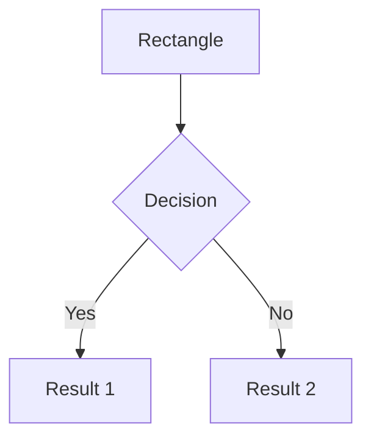

### Direction Options

- `TB` or `TD` - Top to Bottom
- `BT` - Bottom to Top
- `LR` - Left to Right
- `RL` - Right to Left

### Node Shapes

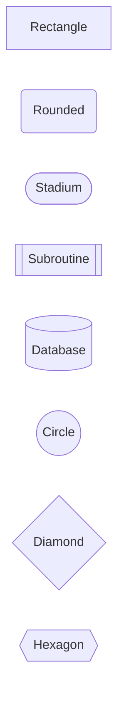

### Edge Types

```mermaid
graph LR
    A --> B    %% Solid arrow
    C -.-> D   %% Dotted arrow
    E ==> F    %% Thick arrow
    G --- H    %% Solid line
    I -.- J    %% Dotted line
    K === L    %% Thick line
```

### Edge Labels

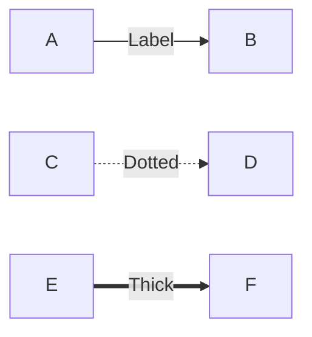

### Subgraphs

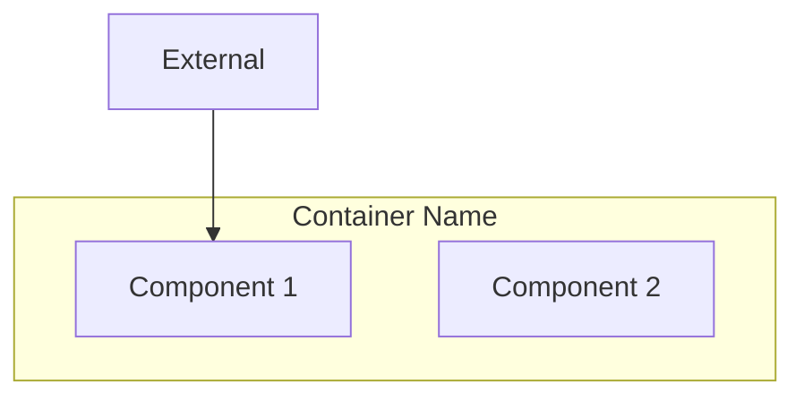

## Flowcharts

### Basic Syntax

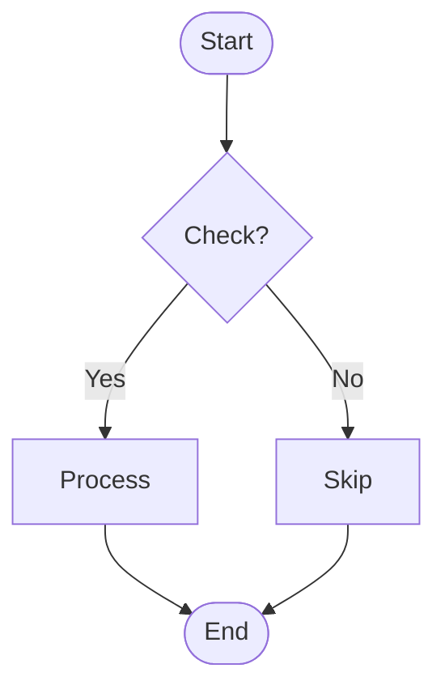

### Extended Node Types (Flowchart-Specific)

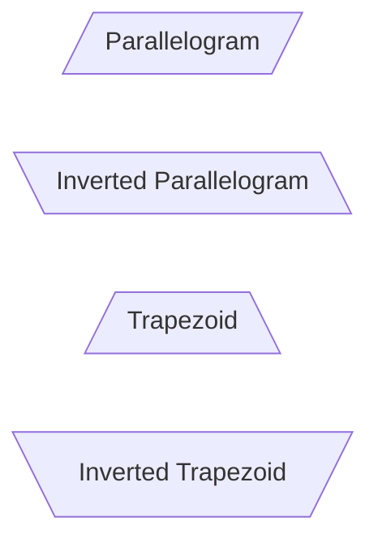

## Sequence Diagrams

### Basic Syntax

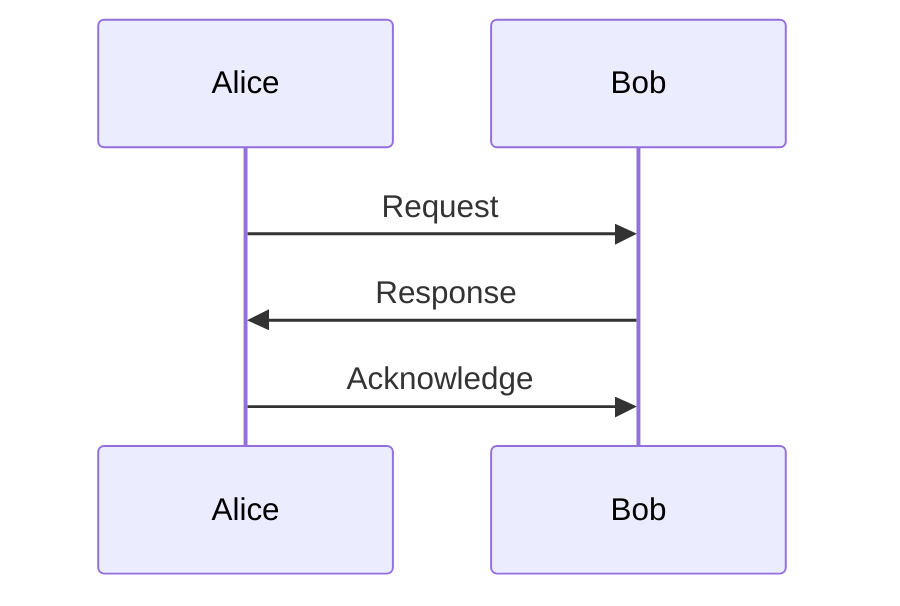

### Message Types

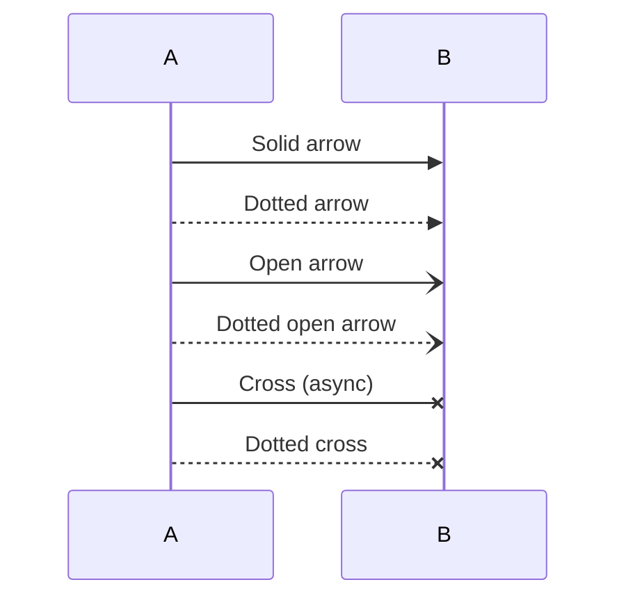

### Activation

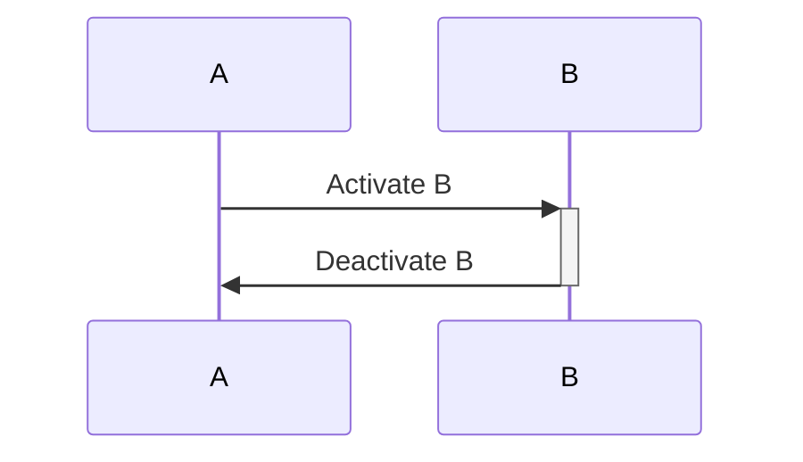

### Notes

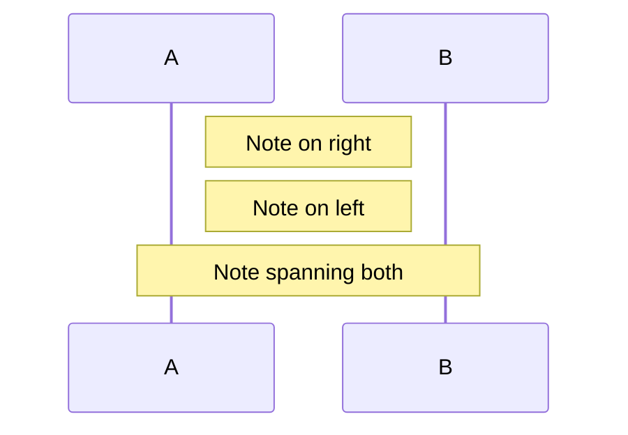

## Styling and Theming

### Theme Configuration

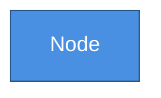

### Available Themes

- `default` - Mermaid default theme
- `base` - Customizable base theme (used in this skill)
- `dark` - Dark mode theme
- `forest` - Forest green theme
- `neutral` - Neutral gray theme

### Class Definitions

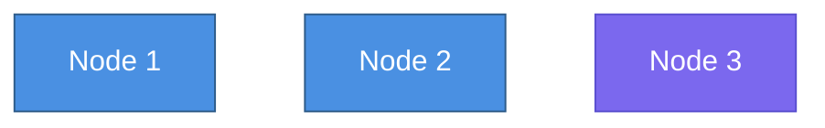

## Common Patterns Used in This Skill

### Architecture Pattern (System Components)

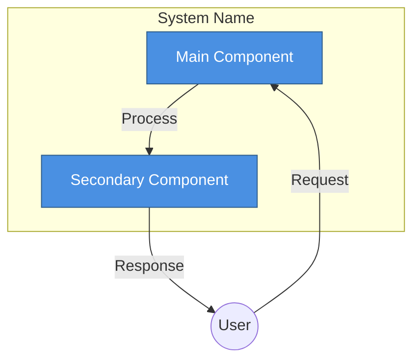

### Flowchart Pattern (Decision Trees)

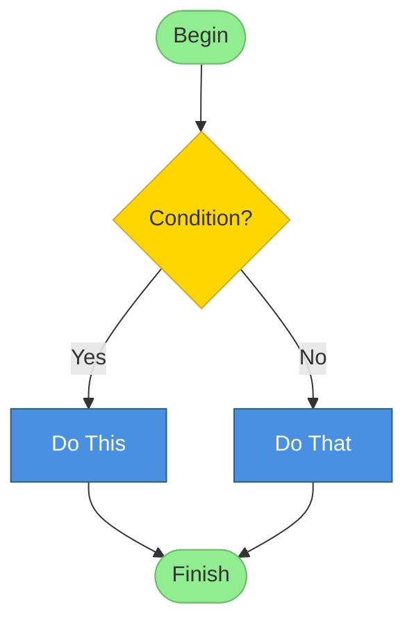

### Sequence Pattern (Actor Interactions)

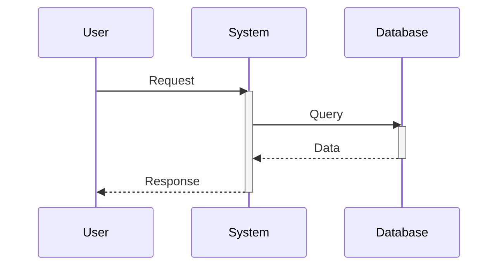

## Best Practices for This Skill

1. **Always include theme initialization block** at the top of each .mmd file
2. **Use consistent color scheme** across all diagrams:
   - Primary Blue: `#4A90E2` (main components)
   - Secondary Purple: `#7B68EE` (supporting elements)
   - Tertiary Green: `#90EE90` (external actors, success)
   - Warning Yellow: `#FFD700` (decisions, cautions)
   - Error Red: `#FF6B6B` (failures, critical paths)

3. **Keep labels concise** - max 8 words per label
4. **Use semantic naming** for placeholders (SYSTEM_NAME, COMPONENT_1, FLOW_1)
5. **Validate syntax** before rendering with `mmdc`
6. **Test rendering** with transparent background (`-b transparent`)

## Troubleshooting Common Syntax Errors

### Error: "Syntax error in graph"
**Cause:** Malformed node or edge definition  
**Fix:** Check for missing brackets, quotes, or arrows

### Error: "Unexpected token"
**Cause:** Special characters not escaped  
**Fix:** Wrap labels in quotes: `A["Label with special chars!"]`

### Error: "Cannot read property"
**Cause:** Invalid theme variable  
**Fix:** Check variable names against Mermaid theme schema

### Error: "Duplicate ID"
**Cause:** Node ID used twice  
**Fix:** Use unique IDs for each node (A, B, C, etc.)

## Advanced Features

### Links in Nodes

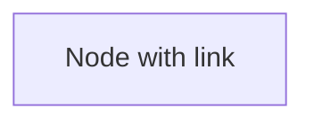

### Comments

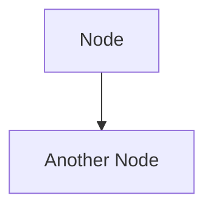

### Direction-Specific Styling

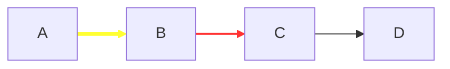

## Rendering Configuration (CLI)

### Basic Rendering

```bash
mmdc -i input.mmd -o output.svg
```

### With Options

```bash
mmdc -i input.mmd -o output.svg \
  -t base \                    # Theme
  -b transparent \             # Background
  -w 1200 \                    # Width (PNG only)
  -H 800                       # Height (PNG only)
```

### Multiple Outputs

```bash
mmdc -i input.mmd -o output.svg  # Vector
mmdc -i input.mmd -o output.png -w 1200  # Raster
```

## Additional Resources

- **Live Editor:** https://mermaid.live/ (test syntax interactively)
- **VS Code Extension:** Markdown Preview Mermaid Support
- **GitHub Support:** Mermaid diagrams render in GitHub Markdown
- **Examples Gallery:** https://mermaid.js.org/ecosystem/integrations.html

---

**Note:** This reference covers the subset of Mermaid syntax used in the skill-mermaid-diagrams. For comprehensive documentation, see https://mermaid.js.org/
